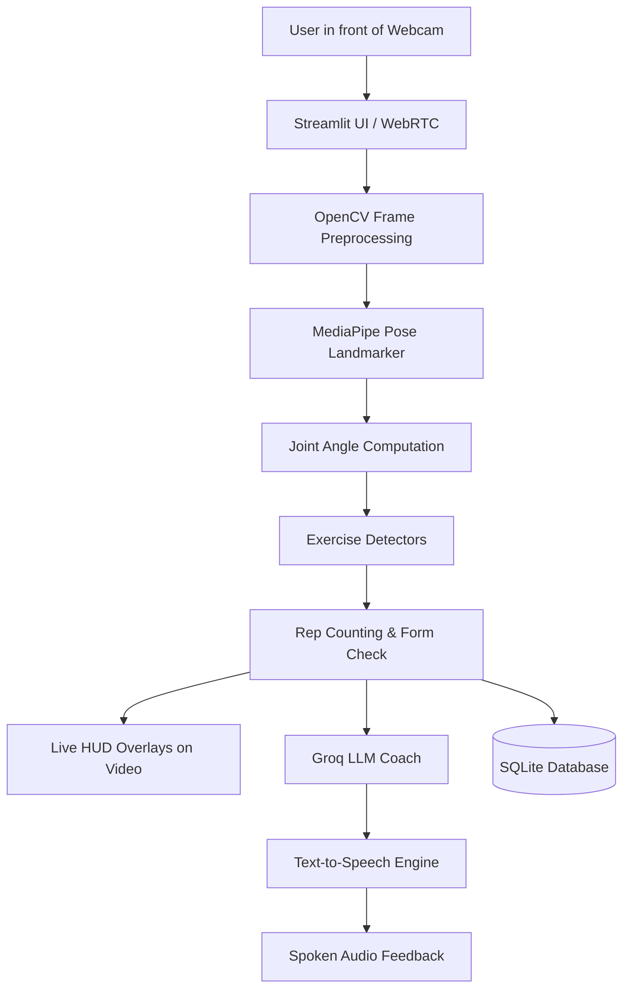
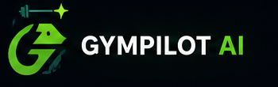
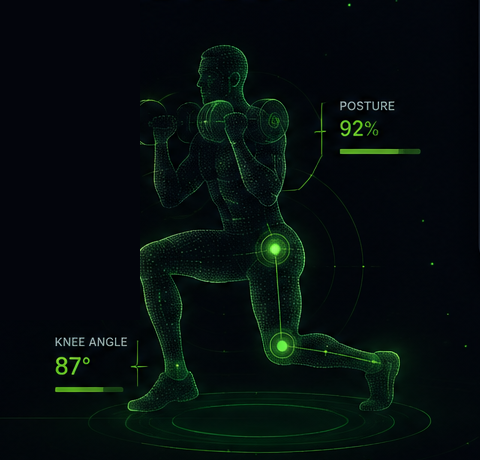

# GymPilot AI 🏋️‍♂️

An interactive, real-time AI gym trainer and workout companion that tracks your movements via webcam, counts repetitions, evaluates exercise form, and provides instant audio coaching feedback.

---

## 📌 Features

- **Real-Time Pose Tracking**: Detects human body landmarks and skeleton connections using MediaPipe.
- **Accurate Rep Counting**: Tracks movement phases (up/down/extension) to count completed repetitions.
- **Live Form Analysis & Angle Badges**: Computes real-time joint angles (e.g., knee depth, elbow extension, back posture) and overlays badges directly on your video stream.
- **Proactive AI Voice Coach**: Uses Groq LLMs to analyze workout events and delivers short, spoken cues via Text-to-Speech (gTTS).
- **Workout Planning**: Select exercise type, target sets, and target reps per set.
- **Session History Logging**: Automatically stores completed sets, total reps, and workout duration in a local SQLite database.
- **Modern Dark Interface**: Custom fitness UI with clear contrast and simple navigation.

---

## 🛠️ Tech Stack

- **Frontend & App Framework**: [Streamlit](https://streamlit.io/)
- **Live Streaming**: [streamlit-webrtc](https://github.com/whitphx/streamlit-webrtc)
- **Computer Vision**: [MediaPipe Tasks](https://developers.google.com/mediapipe), [OpenCV](https://opencv.org/)
- **AI / LLM Coaching**: [Groq Cloud API](https://groq.com/)
- **Voice / Audio**: [gTTS (Google Text-to-Speech)](https://pypi.org/project/gTTS/)
- **Data & Storage**: SQLite, [Pandas](https://pandas.pydata.org/)
- **Environment Management**: [python-dotenv](https://pypi.org/project/python-dotenv/)

---

## ⚙️ How It Works

1. **Camera Feed**: Video frames are streamed from your webcam using WebRTC.
2. **Pose Detection**: MediaPipe Pose Landmarker identifies 33 3D body keypoints in real time.
3. **Biomechanical Angle Calculation**: Calculates 2D/3D joint angles (e.g., hip-knee-ankle, shoulder-elbow-wrist).
4. **State Tracking**: Detectors track movement stages (e.g., eccentric down vs. concentric up) to count reps and flag errors (such as poor squat depth or elbow drift).
5. **HUD Rendering**: Draws skeleton connections, glowing joint nodes, and live angle badges on the active joints.
6. **Voice Coaching**: When reps, sets, or form deviations occur, the event is processed by Groq LLM to generate instant spoken guidance.
7. **Progress Persistence**: Completed workout data is saved to SQLite and aggregated in your workout history.

---

## 🏗️ Architecture Diagram



---

## 📁 Project Structure

```text
GymPilot-AI/
├── core/
│   └── base_exercise.py          # Base class for angle math and landmark helpers
├── detectors/
│   ├── squat.py                  # Squat depth and rep tracking
│   ├── pushup.py                 # Push-up alignment and rep tracking
│   ├── biceps_curl.py            # Bicep curl range of motion and swing detector
│   ├── shoulder_press.py         # Overhead press extension and arch check
│   └── lunges.py                 # Lunge knee flexion and balance detector
├── ml_models/
│   └── pose_landmarker_full.task # MediaPipe pose landmarker model bundle
├── services/
│   ├── auth/
│   │   └── login_wall.py         # Landing & user session authentication UI
│   ├── coaching/
│   │   ├── llm.py                # Groq LLM coaching pipeline & model fallbacks
│   │   ├── tts.py                # Text-to-Speech generation
│   │   └── voice_pipeline.py     # Workout event router & audio autoplay
│   ├── config/
│   │   └── workout_config.py     # Exercise defaults, pose connections, and prompts
│   ├── persistence/
│   │   └── exercise_repository.py# SQLite database operations & history retrieval
│   ├── state/
│   │   └── session_defaults.py   # Streamlit session state initialization
│   ├── tracking/
│   │   └── metrics.py            # Syncs video processor metrics with Streamlit
│   ├── ui/
│   │   └── style_loader.py       # Custom fonts & CSS injectors
│   └── vision/
│       └── exercise_video_processor.py # WebRTC video frame processor & HUD drawing
├── static/
│   ├── style.css                 # Custom dark theme stylesheet
│   └── ...                       # Branding and image assets
├── .env                          # Environment variables (API keys)
├── main.py                       # Main Streamlit application entrypoint
├── requirements.txt              # Project dependencies
└── README.md                     # Documentation
```

---

## 🚀 Installation & Running

### 1. Clone the repository
```bash
git clone https://github.com/miteshkumrawat441-design/GymPilot-AI.git
cd GymPilot-AI
```

### 2. Create and activate a virtual environment
```bash
# Windows
python -m venv .venv
.venv\Scripts\activate

# macOS / Linux
python3 -m venv .venv
source .venv/bin/activate
```

### 3. Install dependencies
```bash
pip install -r requirements.txt
```

### 4. Configure environment variables
Create a `.env` file in the project root and add your Groq API key:
```env
GROQ_API_KEY="your_groq_api_key_here"
```

### 5. Launch the application
```bash
streamlit run main.py
```
Open your browser and navigate to `http://localhost:8501`.

---

## 🏋️ Supported Exercises

| Exercise | Tracked Joints & Angles | Form Checks |
| :--- | :--- | :--- |
| **Squats** | Knee Angle, Back/Hip Angle | Depth detection (Good depth vs. Too high), torso lean |
| **Push-ups** | Elbow Angle, Body Alignment | Body alignment, hip sagging, or piked hips |
| **Biceps Curls** | Elbow Flexion/Extension, Shoulder | Torso swing detection, elbow drift |
| **Shoulder Press**| Arm Extension, Back Arch | Full overhead lockout, lower back arching |
| **Lunges** | Front Knee Angle, Torso Alignment | Knee flexion depth, balance stability |

---

## ⚠️ Limitations

- **Lighting & Visibility**: Requires good ambient lighting and clear visibility of the entire body (head to feet).
- **Single Person Only**: Optimized for one person in the camera frame at a time.
- **Camera Angle**: Best performance is achieved when the camera is placed at waist-to-chest height, roughly 6–8 feet away.
- **Internet Connection**: An active internet connection is needed for Groq LLM API responses and Google TTS voice synthesis.

---

## 🔮 Future Improvements

- [ ] Add more exercises (e.g., Pull-ups, Deadlifts, Planks, Lateral Raises).
- [ ] Offline local voice engine option (e.g., `pyttsx3` or Piper TTS).
- [ ] Exercise history charts and workout analytics dashboard.
- [ ] Rest timer countdown with voice cues between sets.
- [ ] Export workout summaries to PDF or CSV.

---

## 📸 Screenshots

- **GymPilot AI Branding**:
  

- **Real-Time Pose Analysis & Joint Telemetry**:
  